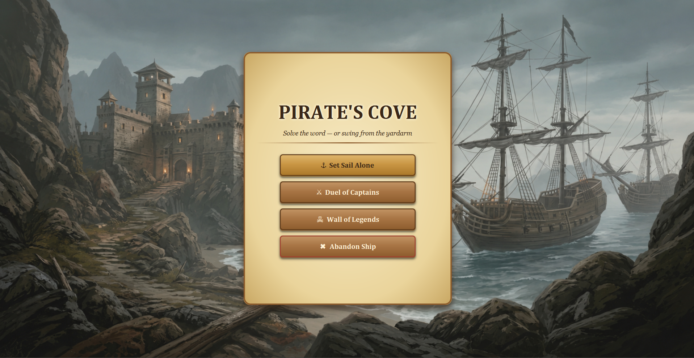
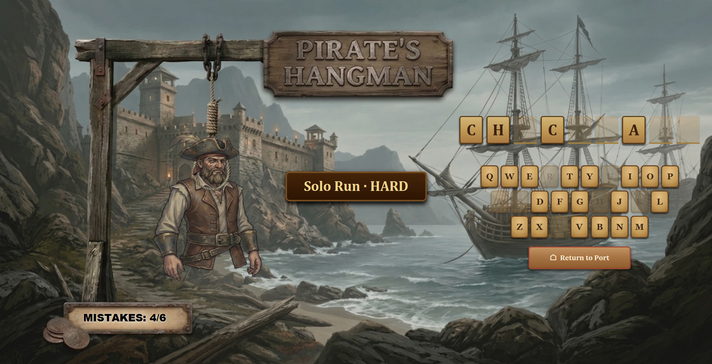
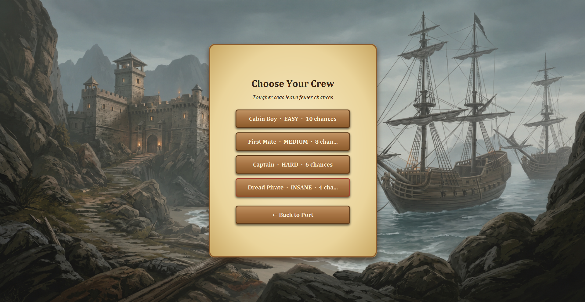
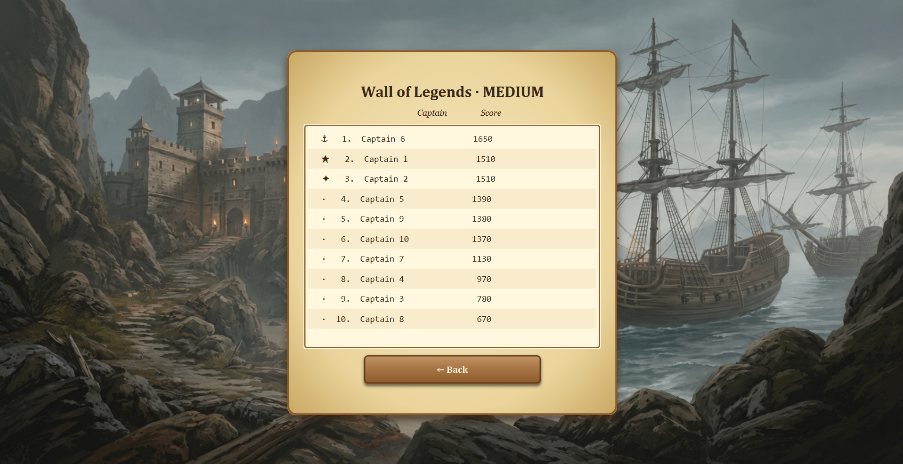

# ☠️ Pirate's Cove — Hangman Game

> **A two-mode Hangman game with a pirate-cove visual theme, built in plain Java with JavaFX for the UI and MySQL/JDBC for the leaderboard.**
> 
> Solve the word before your captain swings from the yardarm.


---

## Features

- **Pirate-themed JavaFX UI** — animated background image that progressively reveals the hanging pirate (5-stage sprite swap) as mistakes accumulate
- **QWERTY virtual keyboard** — styled wooden keys that fade and disable after use
- **4 difficulty levels** — Cabin Boy (10 chances) → First Mate (8) → Captain (6) → Dread Pirate (4)
- **Solo mode** — random word drawn from MySQL; combined score = `chances × 100 + max(0, 1000 − seconds × 10)`
- **1v1 Duel mode** — captains enter secret words for each other; chances granted = unique letters in the word (capped at 7)
- **Sudden Death tie-breaker** — both players face the *same* word at the next difficulty up; time counts this round
- **Wall of Legends** — MySQL-backed top-10 leaderboard, filterable by difficulty
- **Singleton JDBC connection** — credentials loaded from `config.properties` (git-ignored)
- **Separate launcher class** — `Main.java` does not extend `Application`, avoiding the JavaFX crash-before-start on misconfigured IDEs

---

## Screenshots

| Main Menu | Gameplay |
|---|---|
|  |  |

| Difficulty Picker | Wall of Legends |
|---|---|
|  |  |


---

## Project Structure

```
Hanged-man/
├── lib/
│   └── mysql-connector-j-9.7.0.jar
├── sql/
│   └── schema.sql               ← creates hangman_db, Dictionary & Leaderboard tables + 40 seed words
├── src/hangman/
│   ├── Main.java                ← launcher (does NOT extend Application)
│   ├── db/
│   │   ├── DBConnection.java    ← JDBC singleton, reads config.properties
│   │   ├── DictionaryDAO.java   ← getRandomWord(Difficulty)
│   │   └── ScoreDAO.java        ← saveScore / getTop10 / isTop10
│   ├── enums/
│   │   └── Difficulty.java      ← EASY / MEDIUM / HARD / INSANE + chances + word-length bounds
│   ├── managers/
│   │   ├── GameManager.java     ← abstract base
│   │   ├── SinglePlayerManager.java
│   │   └── MultiplayerManager.java
│   ├── models/
│   │   ├── GameSession.java     ← core game engine (guess, isWon, isLost, calculateScore)
│   │   ├── Player.java
│   │   └── ScoreRecord.java
│   ├── resources/               ← background.png, menu_background.png, pirate sprites…
│   ├── services/
│   │   └── ScoreBoard.java
│   └── ui/
│       ├── GameWindow.java      ← JavaFX Application, all scenes
│       ├── BackgroundPane.java  ← dynamic image swap (StackPane)
│       ├── VirtualKeyboard.java ← QWERTY key grid
│       ├── MatchEndMenu.java
│       └── theme.css            ← full pirate theme (Georgia/Cambria, gold, dark wood)
└── config.properties            ← db credentials (git-ignored — never committed)
```

---

## Prerequisites

| Tool | Version |
|---|---|
| JDK | 17 LTS or 21 LTS |
| JavaFX SDK | Matching your JDK |
| MySQL Server | 8.0+ |
| MySQL Connector/J | 9.x — already in `lib/` |

---

## How to Run (IntelliJ IDEA)

**1 — Clone & open**
```bash
git clone <repo-url>
```
Open the folder as a project in IntelliJ IDEA.

**2 — Add libraries**

*File → Project Structure → Libraries → `+`*
- `lib/mysql-connector-j-9.7.0.jar`
- All `.jar` files inside your JavaFX SDK `lib/` folder

**3 — Configure VM options**

*Run → Edit Configurations → Modify options → Add VM options*
```
--module-path "C:/path/to/javafx-sdk/lib" --add-modules javafx.controls
```
Main class: `hangman.Main`

**4 — Set up the database**
```sql
-- Run sql/schema.sql once in MySQL Workbench or CLI
source sql/schema.sql;
```

**5 — Configure credentials**

Create `config.properties` at the project root:
```properties
db.url=jdbc:mysql://localhost:3306/hangman_db?useSSL=false&serverTimezone=UTC
db.user=root
db.password=your_password
```
> This file is git-ignored — your credentials will never be committed.

**6 — Run**

Hit ▶ Run (or `Shift + F10`). The game window opens directly.

---

## Database Schema

Two tables are auto-created by `sql/schema.sql`:

| Table | Purpose |
|---|---|
| `Dictionary` | Words indexed by `ENUM('EASY','MEDIUM','HARD','INSANE')` — 40 words pre-loaded |
| `Leaderboard` | Solo top scores: `player_name`, `difficulty`, `score BIGINT`, `created_at` |

---

## Common Issues

| Error | Fix |
|---|---|
| *JavaFX runtime components are missing* | Check VM options → `--module-path` and `--add-modules` |
| *MySQL JDBC Driver not found* | Confirm `mysql-connector-j-*.jar` is added as a library |
| *Cannot connect to MySQL* | Check MySQL is running and `db.password` is correct in `config.properties` |
| *No words found for difficulty* | Re-run `sql/schema.sql` to reload the seed data |